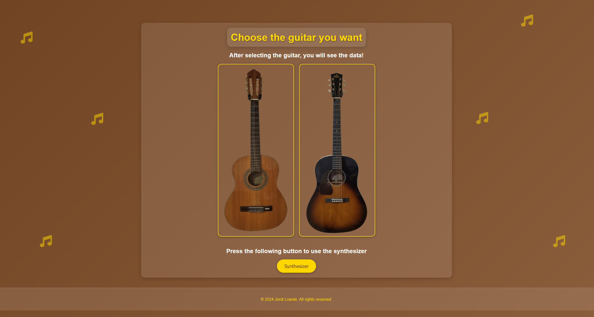

# Sound Analysis and Synthesizer

## Overview
This project is a comprehensive web application for analyzing and synthesizing guitar sounds. It processes acoustic measurements from different guitar types (Acoustic and Western), extracts frequency data, performs spectral analysis, and provides interactive visualization tools. The system also includes a synthesizer that allows users to generate and play guitar tones based on the analyzed frequency data.

## Features

### Sound Analysis
- **Data Processing**: Extracts and processes data from .mat files containing guitar sound recordings
- **Frequency Analysis**: Calculates fundamental frequencies, harmonics, and spectral characteristics
- **Deviation Measurement**: Compares measured frequencies with theoretical values and calculates mean deviation percentages
- **Interactive Visualizations**: Displays FFT plots and comparison diagrams for each sound sample

### Data Management
- **SQLite Database**: Stores all processed data, measurements, and generated plots
- **Search Functionality**: Allows filtering and searching for specific notes or files
- **Guitar Type Categorization**: Organizes data by guitar type (Acoustic vs Western)

### Synthesizer
- **Real-time Sound Generation**: Synthesizes guitar tones based on the analyzed frequency data
- **ADSR Envelope Control**: Adjustable Attack, Decay, Sustain, and Release parameters
- **Waveform Visualization**: Real-time display of the generated sound waveform
- **Multiple Guitar Types**: Switch between Acoustic and Western guitar sound profiles
- **Octave Selection**: Play notes across different octaves
- **Harmonics and Gain Control**: Adjust the harmonic content and volume of synthesized sounds

## Technical Details

### Technologies Used
- **Backend**: Python with Flask web framework
- **Database**: SQLite for data storage
- **Data Processing**: NumPy, SciPy for signal processing and mathematical operations
- **Visualization**: Matplotlib for generating plots and diagrams
- **Frontend**: HTML, CSS, JavaScript for the user interface
- **Audio**: Web Audio API for sound synthesis and processing

### Data Flow
1. Raw sound data (.mat files) is processed using Python scripts
2. Frequency analysis is performed to extract fundamental frequencies and harmonics
3. Results are stored in an SQLite database
4. Web application retrieves and displays the data through interactive interfaces
5. Synthesizer uses the frequency data to generate realistic guitar sounds

## Setup and Usage

### Prerequisites
- Python 3.x
- Required Python packages:
  - Flask
  - NumPy
  - SciPy
  - Matplotlib
  - SQLite3

### Running the Application
1. Clone the repository
2. Navigate to the required directory
3. Run `python app.py`
4. Open a web browser and go to `http://localhost:5000`

### Using the Interface
- **Home Page**: Select between Acoustic or Western guitar analysis, or access the Synthesizer
- **Analysis Pages**: View frequency data, FFT plots, and comparison diagrams for each guitar type
- **Synthesizer**: Experiment with generating guitar sounds and adjusting various parameters

## Project Structure
- `app.py`: Flask application entry point  
- `database.py`: Core data processing and analysis functions  
- `Data/AcousticGuitar/`: Acoustic guitar sound samples (.mat files)  
- `Data/WesternGuitar/`: Western guitar sound samples (.mat files)  
- `templates/`: HTML templates  
- `static/`: CSS, JavaScript, and image files 

## Future Improvements
- Add more guitar types and sound samples
- Implement more advanced sound synthesis algorithms
- Enhance the user interface with more interactive features
- Add export functionality for synthesized sounds

## Database Management Notes

> ⚠️ Changes to the database structure or its content require some manual steps. Please follow the instructions below:

- **`database.py`**  
  This script contains the core logic for analyzing and storing frequency data.  
  If you modify the database structure, make sure to update this script accordingly and re-run it afterward.

- **`allocationGuitars.py`**  
  This script **must be executed after any changes to the database** in order to correctly assign guitar types.

- **`contentDatabase.py`**  
  This script allows you to **query the current content of the database**, particularly to inspect the columns of the `FrequencyData` table.

- **`addingColumToTheDatabase.py`**  
  Use this script to **add new columns** to the database if needed.  
  At the current state, this script **must be run** to add a missing column named `Type`.

> ℹ️ All necessary details and steps are documented within the respective script files.

## Code Notes

- All inline **comments have currently been removed** to improve code clarity and structure.  
- Comments will be **gradually re-added** to make the code more understandable.

## Author
Jordi Lowski Bestit
